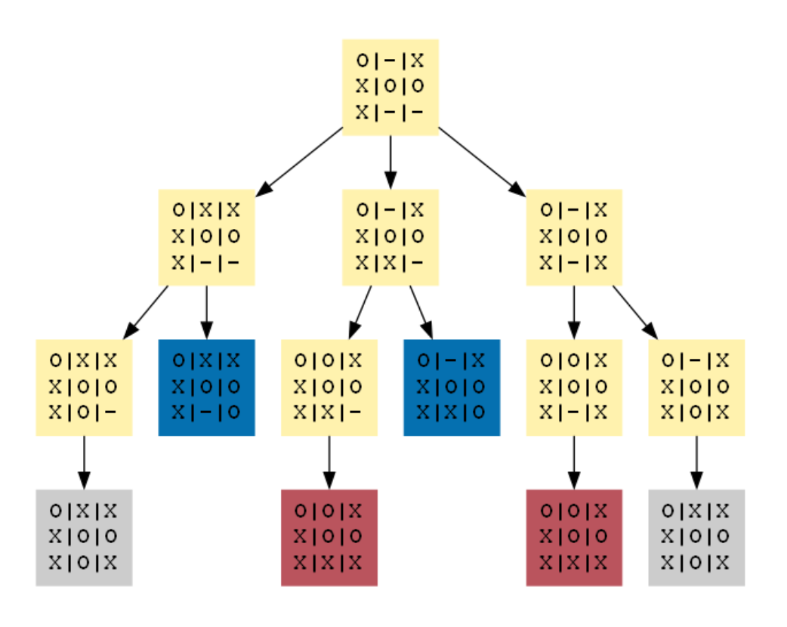

# Visualising Trees of Two Player Games

    

    
    

> **Author**: Berke Muftuoglu · **Date**: April 4, 2023 · **Supervisor**: Hubert Chen

The domain of gaming and game design has evolved significantly over centuries. As the design and complexity of games progressed, there arose a need for more concrete representations of games. Visual aids, specifically graphs, emerged as an ideal solution to represent sequences of transitions between game states.

    

This repository revolves around the visualization of combinatorial game trees using directed graphs. It offers a clear portrayal of the current game state and potential transitions or moves. Users can define their games, observe a tree-like visualization of moves, and even download an XML structure of this representation.

## 📁 Repository Contents

- **Source Code**: The core algorithms and codebase for visualizing game trees.
- **Sample Games**: Sample game definitions for testing and demonstration.
- **Documentation**: Additional details on the methodology and user guide.
- **XML Outputs**: Sample XML structures generated from the visualizations.

## 🔧 Setup & Usage

1. Clone the repository.
2. Navigate to the project directory.
3. Follow the setup instructions in the documentation.
4. Run the main script to visualize your game tree.

## 💌 Feedback & Contributions

Suggestions, bug reports, and pull requests are welcome on GitHub.

## 📜 License

This project is licensed under the **BSD 3-Clause License**. See `LICENSE.md` for more details.

---

